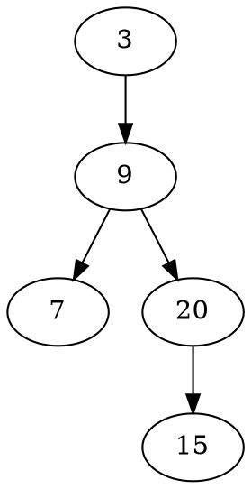

```dot {align="center"}
    digraph {
        3 -> { 9 }
        7 -> { }
        9 -> { 7 20 }
        15 -> { }
        20 -> { 15 }
    }
```

$$
x_1 = \dfrac{边长/2}{\tan\left(\arctan\left(\dfrac{y_0}{x_0}\right) + \alpha\right)}
$$
