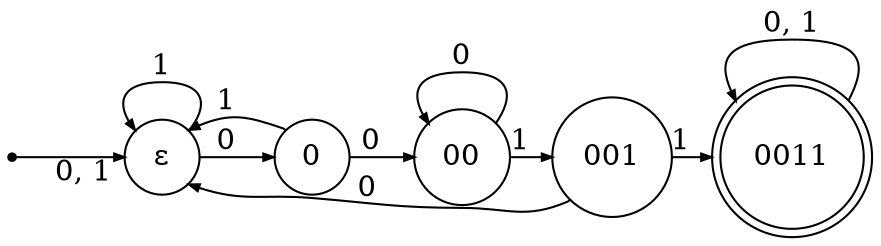

```
0011
1100101100110
```



|              状态转换表               |
| :-----------------------------------: |
| $1 \rightarrow f(1, 0) \rightarrow 0$ |
| $1 \rightarrow f(1, 0) \rightarrow 0$ |
| $0 \rightarrow f(0, 0) \rightarrow 1$ |
| $0 \rightarrow f(0, 1) \rightarrow 2$ |
| $1 \rightarrow f(1, 2) \rightarrow 3$ |
| $0 \rightarrow f(0, 3) \rightarrow 0$ |
| $1 \rightarrow f(1, 0) \rightarrow 0$ |
| $1 \rightarrow f(1, 0) \rightarrow 0$ |
| $0 \rightarrow f(0, 0) \rightarrow 1$ |
| $0 \rightarrow f(0, 1) \rightarrow 2$ |
| $1 \rightarrow f(1, 2) \rightarrow 3$ |
| $1 \rightarrow f(1, 3) \rightarrow 4$ |
|    $0 \rightarrow \textrm{helt.}$     |

:::

### 前缀函数和 Next 数组

明天再写