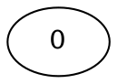
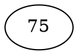
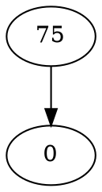
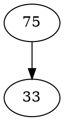
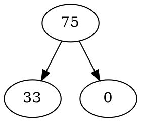
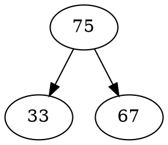
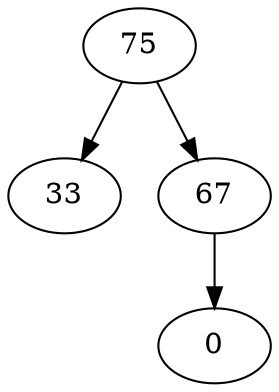
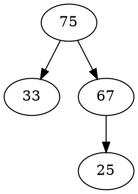

5 -> { 3 7 }
3 -> { 2 4 }
2 -> { }
4 -> { }
7 -> { 6 8 }
6 -> { }
8 -> { }
Hello, Binary Tree!

-------------

-------------

-------------

-------------

-------------

-------------

-------------

-------------

